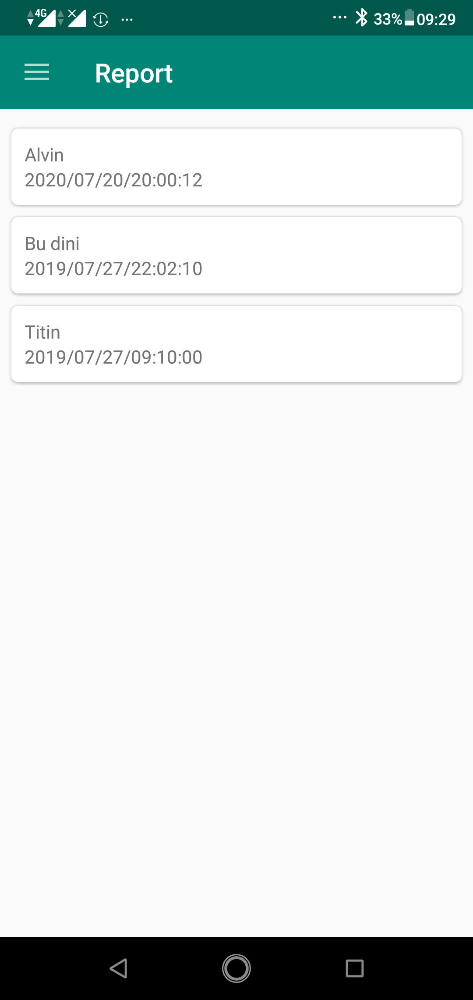

<h1 align="center">
Wireless Stethoscope Electronic
</h1>
An android application using Bluetooth and SQLite to receive and save data from Arduino devices. The purpose of this app is to display and save a person's heartbeat from Arduino devices.

## Screenshots

  
  
  
  
  
   

## Features

- [x] Receive data using bluetooth and display into a graph.
- [x] Save graph data.

## Tech Stack

- [x] Java
- [x] SQLite
- [x] <a href="https://github.com/jjoe64/GraphView" title="GraphView">GraphView</a> 
- [x] <a href="https://github.com/OmarAflak/Bluetooth-Library" title="Bluetooth Library">Bluetooth Library</a> 
- [x] <a href="https://github.com/GoodieBag/Pinview" title="PinView">PinView</a> 

## Author

| [ <b>Alvin Tandiardi</b>](https://github.com/alvintan05)  |
| :-----------------------------------------------------------------------------------------------------------------------------------------------------------------: |
